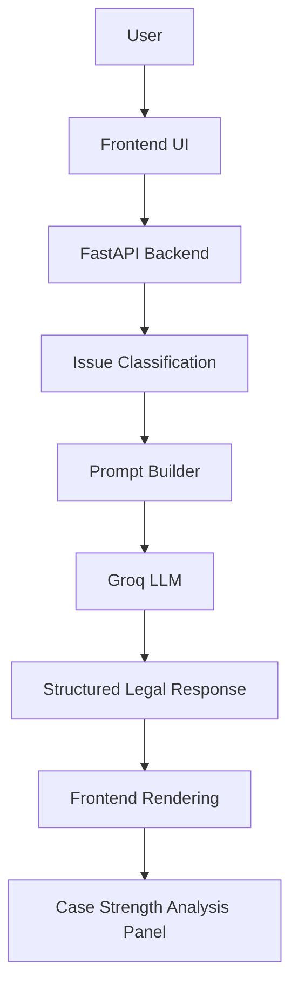
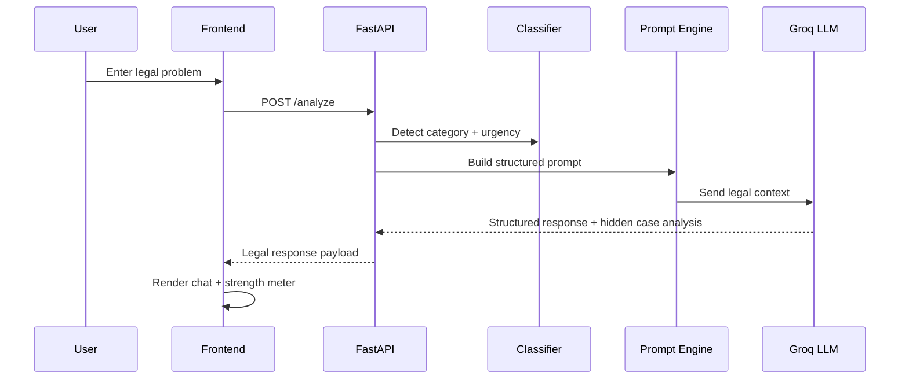

# ⚖️ Advocare

<div align="center">

### AI-Powered Legal Assistance Platform for Indian Citizens

[](https://www.python.org/)
[](https://fastapi.tiangolo.com/)
[](https://developer.mozilla.org/en-US/docs/Web/JavaScript)
[](https://www.sqlite.org/)
[](https://groq.com/)
[](LICENSE)


</div>

---

## 📌 Overview

**Advocare** is an AI-powered legal guidance platform built to help Indian citizens understand their legal rights, identify the relevant legal category, and receive step-by-step guidance in simple language.

It is designed to improve access to legal awareness, especially for people who may not be able to afford immediate legal consultation.

> [!WARNING]
> **Advocare does not replace lawyers and does not provide legal advice.**  
> It provides AI-generated legal information for educational and awareness purposes only.

---

## ✨ Features

| Category | Features |
| --- | --- |
| 🤖 AI Assistance | AI-powered legal guidance, Groq LLM integration, structured legal responses, prompt engineering |
| 🇮🇳 Legal Focus | Indian law focused guidance, automatic legal category detection, issue urgency detection |
| 💬 User Experience | Multi-session chat, chat history, shareable chat links, WhatsApp sharing, PDF export |
| 📊 Analysis | AI case strength analysis, visual case strength meter, strong claims and weak points panel |
| 🌐 Accessibility | English and Hindi support, simple language responses, responsive UI |
| 🔐 Security | JWT authentication, secure session access, protected APIs, input validation |
| 🎨 Interface | Modern glassmorphism UI, sidebar navigation, profile menu, mobile-friendly layout |

### ✅ Included Capabilities

- 🤖 AI-powered legal guidance
- 🇮🇳 Indian law focused
- 💬 Multi-session chat
- 🔐 JWT Authentication
- 📊 AI Case Strength Analysis
- 📈 Visual Case Strength Meter
- 📂 Automatic Legal Category Detection
- 🌐 English & Hindi Support
- 📄 PDF Export
- 📱 Responsive UI
- 📤 WhatsApp Sharing
- ⚡ FastAPI Backend
- ⚡ Groq LLM Integration
- 🧠 Prompt Engineering
- 🗂 Chat History
- 🔒 Secure Authentication
- 🎨 Modern Glassmorphism UI

---

## 🧰 Tech Stack

### Frontend

| Technology | Purpose |
| --- | --- |
| HTML5 | Page structure |
| CSS3 | Styling and responsive glassmorphism UI |
| Vanilla JavaScript | Client-side interactions and API integration |
| Marked.js | Markdown rendering for AI responses |

### Backend

| Technology | Purpose |
| --- | --- |
| Python | Core backend language |
| FastAPI | REST API framework |
| SQLite | Lightweight local database |
| SQLAlchemy | ORM and database models |
| Alembic | Database migrations |
| JWT | Authentication and access control |
| HTTPX | Async API requests to LLM provider |
| Pydantic | Request and response validation |
| SlowAPI | Rate limiting |

### AI Layer

| Technology | Purpose |
| --- | --- |
| Groq API | LLM inference provider |
| GPT OSS 120B | Intended model family reference |
| Prompt Engineering | Structured output, legal response format, hidden case analysis block |

> Note: the current backend implementation uses a Groq-hosted model configured in code.

---

## 🏗️ Project Architecture



### Request Flow



---

## 📁 Folder Structure

```text
Advocare/
├── .github/
│   ├── commands/
│   └── workflows/
├── backend/
│   ├── alembic/
│   │   └── versions/
│   ├── advocare.db
│   ├── alembic.ini
│   ├── auth.py
│   ├── classifier.py
│   ├── db.py
│   ├── legal_links.py
│   ├── llm_service.py
│   ├── main.py
│   ├── models.py
│   ├── prompt_engine.py
│   ├── Req.txt
│   └── test_classifier.py
├── frontend/
│   ├── app.js
│   ├── auth.html
│   ├── contact.html
│   ├── home.html
│   ├── index.html
│   ├── privacy.html
│   ├── profile.html
│   ├── style.css
│   ├── test-strength-panel.html
│   └── toggle.test.js
├── .gitignore
├── GEMINI.md
└── README.md
```

---

## 🖼️ Screenshots

> Replace these placeholders with actual screenshots from the project.

| View | Preview |
| --- | --- |
| Landing Page |  |
| Authentication |  |
| Chat Interface |  |
| Case Strength Panel |  |
| Hindi Support |  |
| PDF Export |  |

<details>
<summary><strong>Markdown block for direct use</strong></summary>

```md


```

</details>

---

## ⚙️ Installation

### 1. Clone the repository

```bash
git clone https://github.com/your-username/advocare.git
cd advocare
```

### 2. Create a virtual environment

```bash
python -m venv .venv
```

**Windows**

```bash
.venv\Scripts\activate
```

**macOS / Linux**

```bash
source .venv/bin/activate
```

### 3. Install backend dependencies

```bash
cd backend
pip install -r Req.txt
```

### 4. Configure environment variables

Create a `.env` file inside `backend/`:

```env
GROQ_API_KEY=your_groq_api_key
SECRET_KEY=your_jwt_secret
DATABASE_URL=sqlite:///./advocare.db
GOOGLE_CLIENT_ID=your_google_oauth_client_id
ACCESS_TOKEN_EXPIRE_MINUTES=60
```

### 5. Run the FastAPI backend

```bash
uvicorn main:app --reload
```

Backend default URL:

```text
http://localhost:8000
```

### 6. Open the frontend

Open one of these files in your browser:

- `frontend/home.html` for the landing page
- `frontend/auth.html` for authentication
- `frontend/index.html` for the main app interface

> For best results, use a local static server for the frontend if your browser blocks certain local file behaviors.

---

## 🔐 Environment Variables

| Variable | Required | Description |
| --- | --- | --- |
| `GROQ_API_KEY` | Yes | API key for Groq LLM access |
| `SECRET_KEY` | Yes | JWT signing secret used by the backend |
| `DATABASE_URL` | Yes | SQLAlchemy database connection string |
| `GOOGLE_CLIENT_ID` | Optional | Enables Google login token verification |
| `ACCESS_TOKEN_EXPIRE_MINUTES` | Optional | JWT token expiry time in minutes |

> If you prefer the label `JWT_SECRET` in documentation, map it to the current backend variable `SECRET_KEY`.

---

## 🧠 How It Works

```text
User enters problem
        ↓
Issue Classification
        ↓
Prompt Engineering
        ↓
LLM Inference
        ↓
Response Parsing
        ↓
Case Strength Analysis
        ↓
Chat Rendering
```

### Processing Pipeline

1. The user submits a legal problem in plain language.
2. The backend classifies the issue into a likely legal category.
3. The system detects urgency for potentially dangerous situations.
4. The prompt engine builds a structured, India-specific legal response prompt.
5. The Groq LLM generates a structured response.
6. The response includes a hidden `CASE_ANALYSIS` block.
7. The frontend parses and renders the visible legal guidance.
8. The hidden analysis powers the case strength meter and claims panel.

---

## 🧾 AI Response Format

Advocare is designed to return structured legal guidance with consistent sections:

- `Issue Type`
- `Steps to Take`
- `Where to File Complaint`
- `Rights`
- `Important Tips`
- Hidden `Case Analysis` block for frontend scoring and insights

### Example Structure

```text
🔍 ISSUE TYPE
[One line summary]

📋 STEPS TO TAKE
1. [Action]
2. [Action]

🏛️ WHERE TO FILE COMPLAINT
- [Authority / Portal]

⚖️ YOUR RIGHTS
- [Right]

💡 IMPORTANT TIP
[Practical guidance]

---CASE_ANALYSIS_START---
STRENGTH_SCORE: 72
POSITIVE_POINTS:
- Strong point
NEGATIVE_POINTS:
- Weak point
---CASE_ANALYSIS_END---
```

---

## ✅ Current Features

- [x] User registration and login
- [x] JWT-based authentication
- [x] Google authentication support
- [x] Protected legal analysis API
- [x] Multi-session chat history
- [x] Session pin, rename, and delete actions
- [x] Legal issue classification
- [x] Urgency detection
- [x] Prompt-based structured AI responses
- [x] Case strength scoring
- [x] Visual case strength panel
- [x] English and Hindi responses
- [x] Shareable chat links
- [x] WhatsApp sharing
- [x] PDF export
- [x] Responsive glassmorphism interface

---

## 🚀 Future Roadmap

- [ ] Voice Input
- [ ] Speech Output
- [ ] OCR Document Analysis
- [ ] Lawyer Directory
- [ ] FIR Draft Generator
- [ ] Court Case Search
- [ ] Multi-language Support
- [ ] RAG with Indian Law Database
- [ ] Mobile App
- [ ] Admin Dashboard
- [ ] Analytics

---

## 🛡️ Security

Advocare includes a basic security foundation suitable for authenticated legal-information workflows:

- JWT authentication for protected endpoints
- Password hashing using `passlib`
- Protected APIs with authenticated user lookup
- Session isolation per user
- Input validation with Pydantic models
- Rate limiting through `slowapi`
- Controlled access to chat sessions and messages

---

## 🤝 Contributing

Contributions are welcome.

1. Fork the repository
2. Create a feature branch
3. Commit your changes
4. Push your branch
5. Open a Pull Request

### Suggested workflow

```bash
git checkout -b feature/your-feature-name
git commit -m "feat: add your feature"
git push origin feature/your-feature-name
```

---

## 📜 License

This project is licensed under the **MIT License**.

---

## 👨‍💻 Author

**Ayush Maurya**  
Final Year B.Tech (AI & ML)

Passionate about AI Engineering, civic-tech, and building technology that solves real problems.

- GitHub: [itsayushmaurya](https://github.com/itsayushmaurya)
- LinkedIn: `Add your LinkedIn profile here`

---

<div align="center">

> "Justice should be accessible to everyone, not just those who can afford it."

</div>
